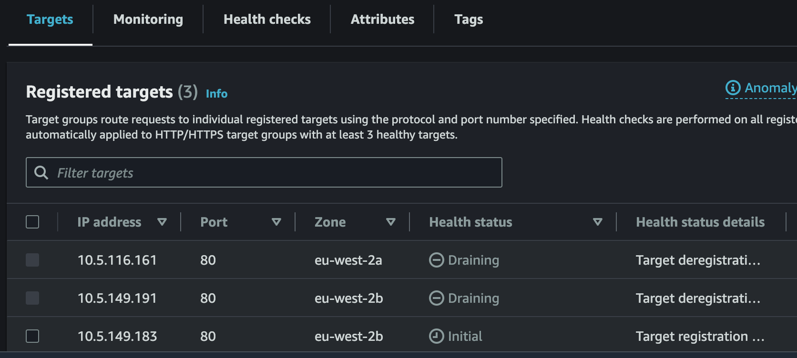

# EKS: avoid errors and timeout during deployment (ALB)

## Scenario
Eks cluster configured with Application loadbalancer. During deployments, pods become unhealthy in target group for short while and causes brief outage.

{ width="600" }

## Root cause
There are 2 possible reasons for this scenario and both must be addressed.
1. ALB taking longer to initialize new pods
2. ALB is slow to detect and drain terminated pods.

## Solution

### Enable pod readiness Gate
Configure [Pod readiness Gate](https://kubernetes-sigs.github.io/aws-load-balancer-controller/v2.7/deploy/pod_readiness_gate/) to indicate that pod is registered to the ALB/NLB and healthy to receive traffic. This will ensure pod is healthy in target group before terminating old pod.

To enable Pod readiness Gate, add label `elbv2.k8s.aws/pod-readiness-gate-inject: enabled` to applications Namespace. Change will be effective for any new pod being deployed.

```yaml
kind: Namespace
metadata:
  labels:
    elbv2.k8s.aws/pod-readiness-gate-inject: enabled
```

### Pod lifecycle preStop
 When a pod is terminated, it can take couple of seconds for ALB to pick up the change and start draining connection. By this time, most likely pod already been terminated by K8s.
Solution to this issue is a workaround. Add a `lifecycle` policy to the pod to [ensure pods are de-registered before termination](https://aws.github.io/aws-eks-best-practices/networking/loadbalancing/loadbalancing/#ensure-pods-are-deregistered-from-load-balancers-before-termination)

```yaml
    spec:
      terminationGracePeriodSeconds: 60
      containers:          
          lifecycle:
             preStop:
               exec:
                 command: ["/bin/sh", "-c", "sleep 60"]

```

Adjust ALB/TG De-registration time to be smaller than lifecycle time by adding annotation `de-registration_delay.timeout_seconds`
```yaml
ingress:
  enabled: true
  className: "alb"
  annotations: 
    alb.ingress.kubernetes.io/scheme: internet-facing
    kubernetes.io/ingress.class: alb
    alb.ingress.kubernetes.io/listen-ports: '[{"HTTP": 80}, {"HTTPS": 443}]'
    alb.ingress.kubernetes.io/ssl-redirect: '443'
    alb.ingress.kubernetes.io/healthcheck-protocol: HTTP
    alb.ingress.kubernetes.io/target-type: ip
    alb.ingress.kubernetes.io/target-group-attributes: deregistration_delay.timeout_seconds=30
```
