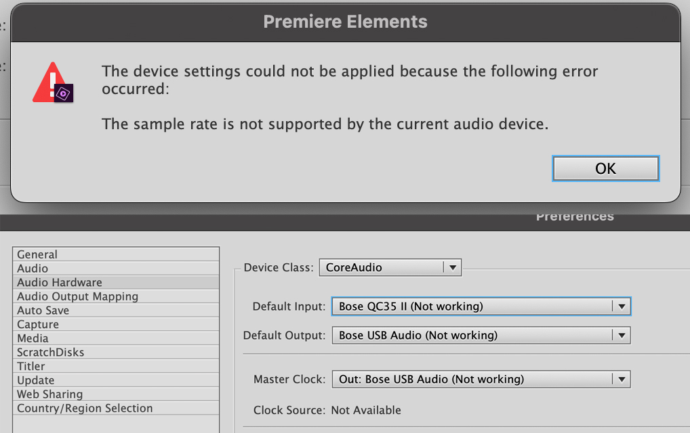
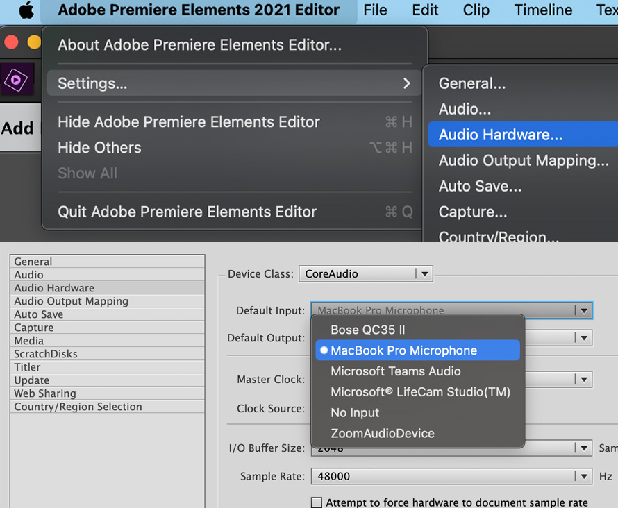
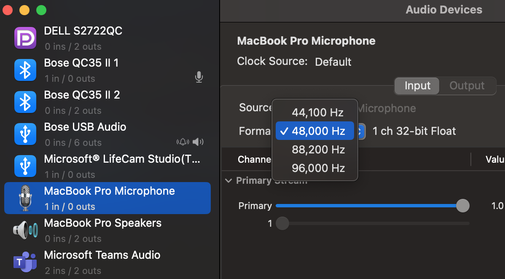

# Adobe Premier : no audio while editing (Mac OS)
While editing video's on Adobe premier, there could be scenarion where audio not working while performing edit. You may also get error stating `The sample rate is not supported by current audio device`. Video itself plays fine on Mac. Changing output hardware does not make difference!

{ width="400" }

It turns out that if Input or output hardware does not support required sample rate, Premier stops the audio completely! In my case my Audio input device was Bose QC35 and Bose Speakers via USB. Since Input device is not supported, audo failed to work despite changing to various output devices include Macbook speaker. Fixed only when input device changed. 

### Solution
Go to Adobe Premier -> settings -> Audio Hardware and update Input/Output device to working device configuration
{ width="400" }

### Alternative
Launch `Audio Midi Setup.app` on Mac and try to match sample rate of your device

{ width="300" }
