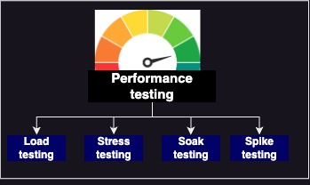

# Performance / Load testing types 
There are four  common performance testing techniques.Each of these techniques achieve different results, which will help to determine how a system performs in terms of responsiveness and stability, as well as whether various attributes of the application adhere to the product specification.

{ width="400" }

### Load testing
Load testing evaluates a system and its behaviour while exposed to a specific load, which is usually the expected volume of traffic the application is likely to be subject to under peak conditions.

### Stress testing
This technique aims to assess the upper limits of the system by simulating an exceptional amount of transactions beyond the expected peak levels covered in load testing. This will also help validate autoscaling. This test aims to find any break points in the system.

### Soak testing
This test validate performance with user load over a longer period of time, it is also important to verify that they can sustain ongoing high performance. Stress testing can help identify memory leaks, CPU usage trends etc.

### Spike testing
Spike Testing simulates a sudden increase or decrease in the amount of users and transactions applied to a system. This form of testing aims to assess whether the infrastructure is able to handle intense changes in load and that performance is maintained in fluctuating conditions.