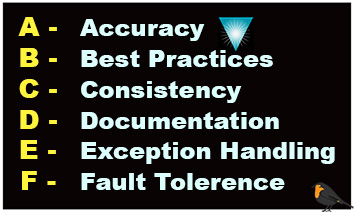

### My Public Repos 
- [Kubernetes](https://github.com/vettom/Kubernetes) Kubernetes exam tips and sample files that works.
- [AWS-Boto3](https://github.com/vettom/Aws-Boto3) Python scripts using AWS Boto3. Also advanced with a text based CMDB
- [Python Basics](https://github.com/vettom/PythonBasics)  :Sample python script and functions for beginners
- [Scripts](https://github.com/vettom/Scripts)  : Few shell scripts working with AWS CLI
- [WHEELCHAIR BASKETBALL](https://vettom.github.io/wheelchairbasketball/) : My take on Wheelchair Basketball tactics

### Scripts 
- [dnsctl.py](https://github.com/vettom/Aws-Boto3#dnsupdatepy)               : Add/remove/update DNS record
- [ec2instance.py](https://github.com/vettom/Aws-Boto3#ec2instancepy)             : Generic Manage Ec2 instance stop/start
- [elbctl.py](https://github.com/vettom/Aws-Boto3#elbctlpy)             : Mange Classig ELB
- [albctl.py](https://github.com/vettom/Aws-Boto3#albctlpy-elb-v2)      : Manage ALB list/status/attach/detach
- [lb-whitelist.py](https://github.com/vettom/Aws-Boto3#lb-whitelistcheckpy)   : Show all SG. rules attached. Or verify is specific IP whitelisted or not
- [ec2-whitelist.py](https://github.com/vettom/Aws-Boto3/blob/master/ec2-whitelistcheck.py)   : List all SG rules attached to Ec2 or find if specific IP whitelisted or not
